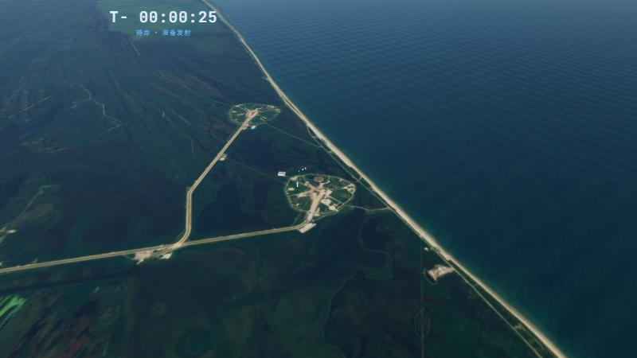
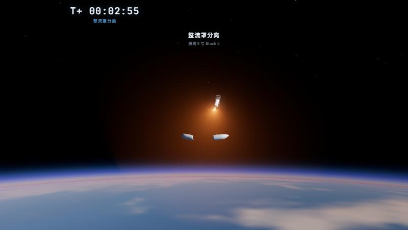
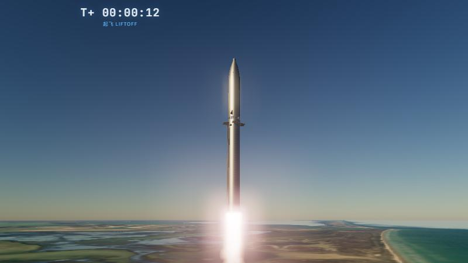
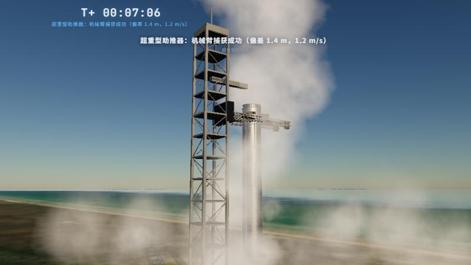
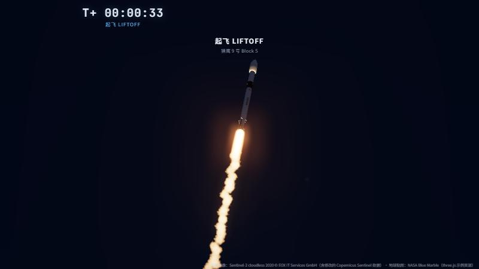
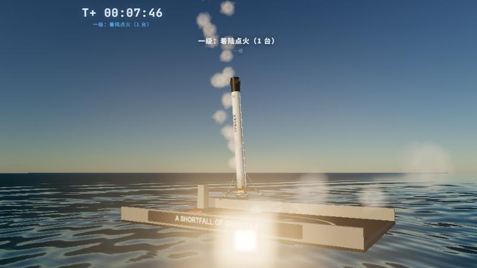

# 🚀 火箭发射仿真实验室 (Rocket Launch Lab)

多型号运载火箭的三维发射与回收仿真：真实尺寸建模、基于物理的飞行动力学、真实卫星影像发射场、可全方位立体观察。

## `lab/` — 火箭发射仿真实验室（v1.1，推荐）

| | |
|---|---|
|  |  |
|  |  |
|  |  |

### 型号与任务

| 型号 | 任务 | 发射场 | 回收 |
|---|---|---|---|
| 猎鹰 9 号 Block 5 | 星链组网 / RTLS 陆上回收 | 肯尼迪 39A | 无人船海上回收 / 1 号着陆区 |
| 猎鹰重型 | 重型演示任务 | 肯尼迪 39A | 双侧助推器同步返场 + 芯级海上回收 |
| 星舰 / 超重型 | IFT-5 | 星际基地（得州） | 发射塔"筷子"机械臂空中捕获 |
| 土星五号 | 阿波罗 11 号（进入停泊轨道） | 肯尼迪 39A（1969） | — |
| 长征五号乙 | 天和核心舱 | 文昌 101 工位 | — |

### 物理仿真（`lab/js/physics/`，可脱离浏览器在 Node 中运行）

- **大气**：1976 美国标准大气（0–86 km 分层解析解，86–1000 km 查表插值），给出密度、压强、声速
- **发动机**：推力随环境压强变化 `F = τ·Fvac − p·Ae`，质量流量由真空比冲决定；带点火爬升/关机衰减、最小节流限制
- **气动**：马赫数相关的轴向力系数（头部迎风 / 尾部迎风两套），细长体理论 + 横流阻力的法向力（有攻角时产生升力）
- **积分**：地心惯性系 RK4，步长 0.02 s；计入地球自转（发射方位角在射面内的分量）
- **上升制导**：垂直上升 → 程序转弯 → 零攻角重力转弯；最大动压节流；上面级采用线性径向加速度闭环制导（类 PEG）并按目标轨道能量关机，关机前限制过载
- **回收制导**：冷气翻转 → 返场点火（推力矢量偏航同时修正横向落点）→ 再入点火 → 栅格翼气动修正 → 着陆点火（落点预测含阻力与点火过程；油门由"刹停高度"反解；横向 ZEM/ZEV 最优制导）；多发动机"切换门"逻辑（超重型 13→3 台，猎鹰重型芯级 3→1 台）；筷子捕获末段速度跟踪缓降
- **任务预演**：载入时先确定性地完整仿真一遍，得到无人船位置与事件时间表

`node lab/tools/test_flight.mjs` 可无界面跑完全部任务，输出事件时间与真实飞行时间线的对比，例如：

- 土星五号：S-IC 中心发动机关机、S-II 中心发动机关机与实测一致；S-IVB 入轨关机 T+11:31（实测 T+11:39），轨道 191 × 189 km（实测 191 × 184 km）
- 长征五号乙：助推器分离 T+2:54（参考约 T+2:54），芯级关机 T+8:04，船箭分离 T+8:18（实测 T+8:14）
- 猎鹰 9 号星链：MECO T+2:26（参考 T+2:27），SECO T+8:43（参考 T+8:39），一级着陆偏差 0.1 m、触地 2.6 m/s
- 星舰 IFT-5：MECO T+2:36（参考 T+2:39），筷子捕获 T+7:04（参考 T+6:53），偏差 1.4 m

### 三维场景

- **建模**：按真实尺寸程序化建模——Merlin/猛禽/F-1/J-2/YF-77/YF-100 钟形喷管、钛合金栅格翼、可展开着陆腿、分瓣整流罩、星舰不锈钢焊缝与六边形防热瓦、热分离环、土星五号滚转识别涂装与逃逸塔、长征五号斜切头锥助推器
- **发射场**：真实卫星影像（Sentinel-2 cloudless，三级细节）+ 真实地理方位；LC-39A（起竖架、勤务塔、水塔、储罐）、阿波罗时代红色脐带塔与摆臂、星际基地发射台与"筷子"塔、文昌脐带塔与避雷塔；1 号着陆区按真实经纬度；无人回收船
- **大气与地球**：单次散射（Rayleigh + Mie + 臭氧 + 地影）天空、晨昏多次散射近似；地球使用真实贴图、云层、城市灯光、海面高光与大气透视；本地地形与地球用同一散射模型
- **尾焰**：体积光线步进，逐台发动机射流、海平面马赫环、随高度膨胀的欠膨胀羽流（质量守恒归一化）、多喷流融合，按推进剂区分颜色；喷管内壁与 MVac 喷管延伸段高温发光
- **烟雾**：导流槽蒸汽、星舰发射台径向扬尘、按飞行距离均匀布点的尾迹（按粒子所在高度计算日照，黎明发射可见高空被照亮的尾迹）、着陆扬尘、冷气推力器、热分离排气、反推/逃逸塔固体发动机
- **镜头**：自由观察、地面长焦跟踪（自动变焦）、伴飞、箭载相机、发射台近景；可切换跟随任意箭体（助推器、飞船、整流罩等）
- **光照时段**：黎明 / 上午 / 正午 / 黄昏 / 夜间，自动曝光

### 运行

实验室使用 ES 模块并在线加载 Three.js 与卫星影像，需要通过 HTTP 访问（直接双击 html 会被浏览器拦截）：

- Windows：双击 `启动仿真实验室.bat`
- 或：`python lab/tools/serve.py 8765`，然后打开 http://localhost:8765/lab/
- GitHub Pages 部署后直接访问 `/lab/`

URL 参数：`?v=starship&m=ift5&cam=tracking&tod=dawn`

快捷键：空格 开始/暂停 · 1–5 镜头 · T 切换目标 · N 下一事件 · [ ] 调速 · H 隐藏界面

影像署名：Sentinel-2 cloudless 2020 © EOX IT Services GmbH（含修改的 Copernicus Sentinel 数据，CC BY-NC-SA 4.0）；地球贴图来自 three.js 示例资源（NASA Blue Marble）。

---

## 早期版本

借鉴 SpaceX 火箭的交互式飞行模拟器，体现真实的发射与回收机制，科技感界面，双击即可在浏览器运行。

## 模拟内容

### `starship_3d.html` — 星舰 3D 真实版 + 筷子回收（推荐）⭐ v2.0 新增
用 **Three.js** 实现的真三维模拟，可用鼠标拖动旋转视角、滚轮缩放。在线加载 Three.js（需联网）。

- **真实质感**：PMREM 环境反射贴图（不锈钢镜面反光）+ ACES 电影级色调映射 + sRGB，告别卡通塑料感
- **箭体细节**：焊接环缝、可见的猛禽发动机喷管（3/10/20 三环）、格栅翼、热分离排气环、捕获销
- **酷炫尾焰**：每台发动机外焰 + 高亮内核 + 马赫环 + 加性辉光 + 暖色点光源；点火/着陆的蒸汽烟云粒子
- **桁架式发射塔**：四柱 + 横/斜撑 + 快速断开臂 + 机械夹臂
- **完整流程**：点火 → 上升 → 热分离 → 返场点火 → 滑行 → 再入点火 → 下降 → 横向飞回发射塔 → 着陆点火 → 机械夹臂在颈部捕获（捕获销对准格栅翼下方）

### `starship_sim.html` — 星舰 2D 版 + 筷子回收
纯 HTML5 Canvas（无依赖）。还原 **Starship / Super Heavy** 两级构型，重点体现 **Mechazilla 机械夹臂（"筷子"）空中捕获**回收机制：
还原 **Starship / Super Heavy** 两级构型，重点体现 **Mechazilla 机械夹臂（"筷子"）空中捕获**回收机制：

- **发射段**：33 台猛禽发动机集群点火 → 升空 → 重力转向 → 最大动压（Max-Q）
- **热分离（hot-staging）**：飞船在助推器关机前提前点燃发动机，透过排气环喷射
- **回收段**：返场点火（boostback）→ 翻转 → 格栅翼调姿 → 再入点火 → 着陆点火 → 飞回发射塔 → 机械夹臂合拢，夹住格栅翼下方捕获销，助推器悬停在空中被夹住
- **镜头切换**：跟随助推器看回收，或跟随飞船看二级入轨
- 不锈钢箭体、鼻锥、前后襟翼、背风面隔热瓦等细节

### `falcon9_sim.html` — 猎鹰 9 号 + 腿式/海上回收
还原 **Falcon 9** 两级构型，体现传统的**着陆腿 + 无人船/陆上回收**：

- 发射 → 级间分离 → 返场点火 → 栅格翼滑行 → 再入点火 → 自杀式着陆点火 → 着陆腿展开 → 触地
- 可切换 **海上回收 (ASDS)** 无人船 / **陆上回收 (RTLS)** 返回发射场

## 共同特性

- 实时遥测 HUD：高度、速度、下程距离 / 发动机数量、两级燃料余量、任务时钟 T+
- 相机随箭体自动跟随与缩放，星空 / 云层 / 地面滚动表现高度与速度
- 飞行轨迹尾迹绘制
- 速度倍率控制（0.5x – 3x）、复位
- 科技感深色控制台风格界面

## 运行方式

直接用浏览器打开任意 `.html` 文件即可。2D 版（`starship_sim.html` / `falcon9_sim.html`）无需任何依赖；3D 版（`starship_3d.html`）会从 CDN 在线加载 Three.js，需联网。

## 版本

- **v1.1** — 新增 `lab/` 火箭发射仿真实验室：五型火箭、物理飞行仿真与闭环制导、真实卫星影像发射场、体积尾焰、大气散射
- **v2.0** — 新增 Three.js 真实 3D 版（`starship_3d.html`）：金属反射、电影级色调、桁架发射塔、多层尾焰与烟云粒子；修复机械夹臂捕获高度与助推器返场对位
- **v1.0** — 2D 版：星舰筷子回收 + 猎鹰 9 号着陆腿/海上回收
